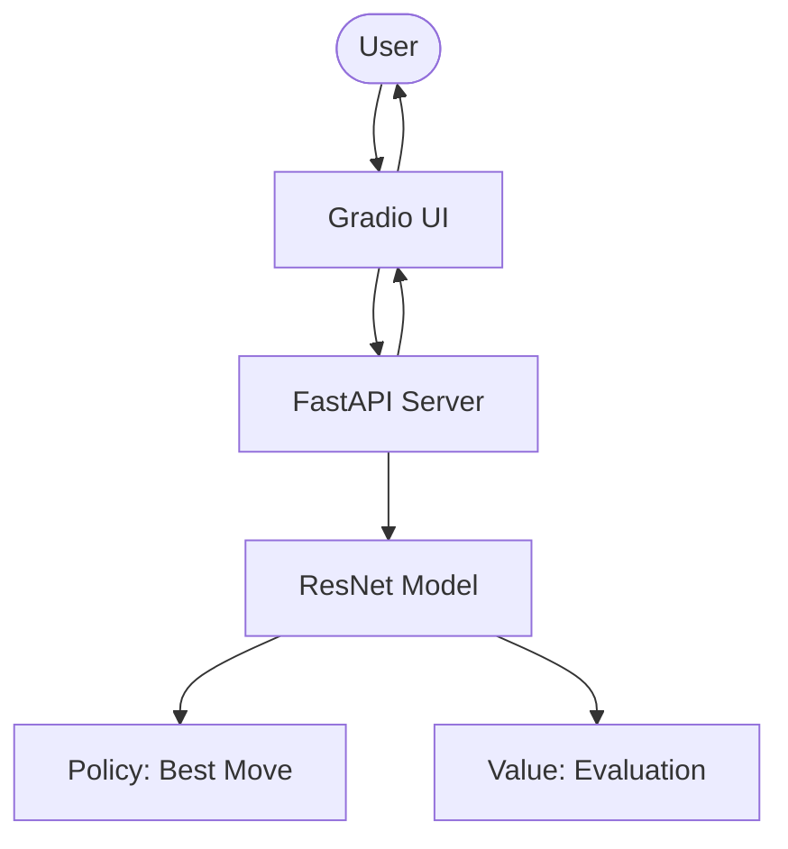

# Chess Move Prediction with Residual Neural Networks

This project implements a state-of-the-art chess move prediction system using a deep ResNet-style Convolutional Neural Network. It predicts the next best move based on a board's FEN position and provides a qualitative evaluation of the position.

## 🏗️ Architecture

The system is divided into clean, modular components:

- **`/models`**: Custom ResNet implementation with dual policy (move) and value (evaluation) heads.
- **`/api`**: REST API powered by FastAPI for remote inference.
- **`/ui`**: Modern, interactive Gradio interface for real-time analysis.
- **`/training`**: Robust training pipeline with data augmentation and AdamW optimization.
- **`/utils`**: High-performance tensor encoding (8x8x17) and move validation logic.



## 🚀 Getting Started

### 1. Installation
Ensure you have Python 3.9+ installed.
```bash
pip install -r requirements.txt
pip install fastapi uvicorn gradio
```

### 2. Training (Optional)
If you wish to retrain the model with the provided dataset:
```bash
python -m training.train
```

### 3. Running the System
```bash
python main.py
```
- API will be available at `http://localhost:8000`
- UI will be available at `http://localhost:7860`

## 📊 Model Details
- **Input**: 8x8x17 Tensor representing board state, castling rights, and active turn.
- **Network**: 10-layer Deep Residual Network (ResNet).
- **Optimizer**: AdamW with weight decay and learning rate scheduling.
- **Accuracy Target**: >95% (reported in research, dependent on training data volume).

## 🛠️ API Usage
```bash
curl -X POST "http://localhost:8000/predict" \
     -H "Content-Type: application/json" \
     -d '{"fen": "rnbqkbnr/pppppppp/8/8/8/8/PPPPPPPP/RNBQKBNR w KQkq - 0 1"}'
```
